# Architecture Overview

This document describes the current frontend architecture for TrustLink and how the main pieces connect during a typical escrow flow.

## Component Tree

```mermaid
flowchart TD
    %% ── App Router ──
    A[app/] --> B[layout.tsx<br/>Root Layout & Provider Tree]
    A --> C[page.tsx<br/>Landing Page]
    A --> D[dashboard/page.tsx<br/>Vendor Dashboard]
    A --> E[pay/escrowId/page.tsx<br/>Buyer Payment]
    A --> F[track/escrowId/page.tsx<br/>Order Tracking]
    A --> G[admin/disputes/page.tsx<br/>Admin Panel]
    A --> H[onboarding/page.tsx<br/>Vendor Onboarding]
    A --> I[notifications/page.tsx<br/>Notifications]
    A --> J[api/<br/>Next.js API Routes]

    %% ── Providers (mounted in layout.tsx) ──
    P[components/providers/]
    P --> P1[ThemeProvider]
    P --> P2[NetworkProvider]
    P --> P3[WalletProvider<br/>Freighter + SEP-10]
    P --> P4[SubscriptionProvider<br/>Plan FREE/PRO]
    P --> P5[CurrencyProvider]
    P --> P6[I18nProvider]
    P --> P7[NotificationProvider<br/>Polling + read state]
    P --> P8[ServiceWorkerProvider]

    %% ── Domain Components ──
    C1[components/escrow/]
    C1 --> C1a[EscrowCreateForm]
    C1 --> C1b[EscrowLinkCard]
    C1 --> C1c[DisputeForm<br/>+ DisputeStep*]
    C1 --> C1d[TrackingTimeline]

    C2[components/dashboard/]
    C2 --> C2a[VendorDashboardList<br/>+ Card/Table Toggle]
    C2 --> C2b[EscrowTableRow]
    C2 --> C2c[VendorAnalyticsSection]
    C2 --> C2d[TransactionHistoryExport]
    C2 --> C2e[ShipTrackingModal]

    C3[components/payment/]
    C3 --> C3a[PaymentSection]
    C3 --> C3b[PaymentForm]
    C3 --> C3c[TrustBadge]
    C3 --> C3d[EscrowCountdown]

    C4[components/notifications/]
    C4 --> C4a[NotificationBell<br/>Dropdown + unread badge]
    C4 --> C4b[NotificationsPageContent]

    C5[components/onboarding/]
    C5 --> C5a[VendorOnboardingWizard<br/>3-step + localStorage]

    C6[components/subscription/]
    C6 --> C6a[ProGate<br/>Feature gating]
    C6 --> C6b[UpgradeCTA]

    C7[components/layout/]
    C7 --> C7a[Navbar]
    C7 --> C7b[Footer]
    C7 --> C7c[BottomNav]
    C7 --> C7d[TestnetBanner]

    C8[components/ui/]
    C8 --> C8a[shadcn/ui primitives<br/>Button Dialog Skeleton etc.]

    %% ── Hooks ──
    HK[hooks/]
    HK --> HK1[useWallet]
    HK --> HK2[useEscrow]
    HK --> HK3[useTracking]
    HK --> HK4[useNetwork]
    HK --> HK5[useNotifications]
    HK --> HK6[useSubscription]
    HK --> HK7[useCurrency]
    HK --> HK8[useToast]

    %% ── Lib / Utils ──
    L[lib/]
    L --> L1[api/client.ts<br/>getVendorEscrows createEscrow etc.]
    L --> L2[stellar/contract.ts<br/>Soroban calls]
    L --> L3[stellar/freighter.ts<br/>Wallet SDK wrapper]
    L --> L4[stellar/horizon.ts<br/>Horizon helpers]
    L --> L5[notifications.ts<br/>deriveNotifications]
    L --> L6[rateLimit.ts<br/>Upstash / memory]
    L --> L7[explorer.ts<br/>Stellar Expert links]
    L --> L8[utils/currency.ts<br/>formatUSDC]

    T[types/]
    T --> T1[escrow.ts]
    T --> T2[notifications.ts]
    T --> T3[subscription.ts]

    %% ── Relationships ──
    B --> P
    D --> C2
    E --> C3
    F --> C1d
    G --> C1c
    H --> C5a
    I --> C4b
    C2a --> C2b
    C4a --> P7
    C5a --> P3
    C6a --> P4
    C7a --> C4a
    C7a --> P2

    HK1 --> P3
    HK2 --> L1
    HK3 --> L1
    HK5 --> P7
    HK6 --> P4
    HK1 --> L3
    HK2 --> L2
    C1a --> HK2
    C3b --> HK1
    C1d --> HK3
    C2a --> HK2
    C4a --> HK5

    L1 --> L6
    L2 --> L3
    L2 --> L4

    %% ── Notification subsystem highlight ──
    P7 -.->|polls 30s| L1
    P7 -.->|derive| L5
    C4a -.->|reads| P7

    %% ── Subscription subsystem highlight ──
    P4 -.->|caches 5m| L1
    C6a -.->|checks isPro| P4

    %% ── Onboarding highlight ──
    C5a -.->|persists| HK1
```



### Legend

| Symbol | Meaning |
|--------|---------|
| `[...]` rectangle | Module / file / component — a concrete code unit under `app/`, `components/`, `hooks/`, `lib/` or `types/` |
| `subgraph` grouping (implied by prefix `P`, `C*`, `HK`, `L`, `T`) | Logical subsystem: **P** = Providers, **C1–C8** = Component domains, **HK** = Hooks, **L** = Library utilities, **T** = Types |
| `A --> B` solid arrow | **Renders / imports / calls** — e.g., `dashboard/page.tsx` renders `VendorDashboardList`, `useWallet` reads `WalletProvider` |
| `-.->` dashed arrow | **Async / polling / indirect data flow** — e.g., `NotificationProvider` polls `getVendorEscrows` every 30s, `deriveNotifications` transforms escrows |
| `layout.tsx --> P` | Root layout mounts the provider tree that wraps the entire app — all client components must be descendants of these providers |
| `NotificationBell` + `NotificationsPageContent` | **Notification subsystem** — `NotificationProvider` polls escrows, derives `AppNotification[]`, tracks read IDs in `localStorage`, exposes `useNotifications()` |
| `VendorOnboardingWizard` | **Onboarding subsystem** — 3-step wizard (`Connect Wallet → Vendor Profile → Review`), state persisted to `localStorage` (`vendor.onboarding.state`), auto-advances on `useWallet().isConnected` |
| `SubscriptionProvider` + `ProGate` | **Subscription subsystem** — fetches `getSubscription()`, caches plan 5 min (`subscription.cache`), `useSubscription()` exposes `isPro`, `ProGate` gates pro-only UI |

> **Mermaid rendering note:** This diagram uses `flowchart TD` (top-down) with only alphanumeric IDs and HTML `<br/>` line breaks, which GitHub's Mermaid renderer supports. Avoid using `:` or `()` in node IDs if you extend the diagram.

## Data Flow

1. The user enters the app through the Next.js App Router under `app/`.
2. `app/layout.tsx` mounts the provider tree: `ThemeProvider → NetworkProvider → WalletProvider → SubscriptionProvider → CurrencyProvider → I18nProvider → NotificationProvider`.
3. Route-level pages (`dashboard`, `pay/[id]`, `track/[id]`, `onboarding`, `notifications`, `admin`) render domain components from `components/`.
4. Components use hooks in `hooks/` (`useWallet`, `useEscrow`, `useTracking`, `useNotifications`, `useSubscription`, etc.) to read wallet, escrow, notification, and subscription state.
5. Hooks and components call utility modules in `lib/` for API requests (`lib/api/client.ts`), Stellar interactions (`lib/stellar/contract.ts`, `lib/stellar/freighter.ts`), local storage (`escrowStore.ts`), and derived data (`lib/notifications.ts`).
6. Shared contracts and response shapes are defined in `types/` (`escrow.ts`, `notifications.ts`, `subscription.ts`).

## Main Responsibilities

- `app/` — route entry points and page composition. Thin pages that compose providers and domain components.
- `components/providers/` — React context providers that own state, side-effects, and persistence (wallet, notifications, subscription, currency, network, theme).
- `components/escrow|dashboard|payment|notifications|onboarding|subscription|layout|ui/` — UI sections, forms, provider consumers, and page-specific views.
- `hooks/` — reusable state and side-effect orchestration. Preferred public API for accessing provider state (e.g., `useWallet`, `useNotifications`, `useSubscription`).
- `lib/` — network access, storage helpers, Stellar integration, rate limiting, and derived-data logic.
- `types/` — shared TypeScript definitions used across the frontend.

## Typical Escrow Flow

1. A vendor completes `VendorOnboardingWizard` (connect wallet → profile → review) and opens `EscrowCreateForm`.
2. The form uses `useEscrow` and `lib/api/client.ts` to create the link / escrow record (`POST /api/escrow`).
3. The buyer visits `pay/[escrowId]` (`PaymentSection` + `PaymentForm`) or `track/[escrowId]` (`TrackingTimeline`) and connects a wallet via `WalletProvider` / `useWallet`.
4. Wallet actions (`connect`, `signTransaction`) are handled through `WalletProvider` and the Stellar helper layer (`lib/stellar/freighter.ts`, `lib/stellar/contract.ts`).
5. `NotificationProvider` polls `getVendorEscrows` every 30s, derives notifications via `lib/notifications.ts`, and `NotificationBell` displays the unread badge / dropdown; `NotificationsPageContent` shows the full list.
6. Tracking and status updates are rendered from the escrow and timeline components; `VendorDashboardList` supports a persisted Card/Table toggle for the vendor's escrow list.
7. Pro-only features are gated by `SubscriptionProvider` (`isPro`) and `ProGate` / `UpgradeCTA`.

This structure keeps page routes thin, UI components reusable, and wallet/escrow/notification/subscription logic isolated for easier maintenance.

## Provider Access Patterns

All provider state has a single supported hook entry point — import the hook, never the provider directly:

| Provider | Hook | Mounted in | Owns |
|----------|------|------------|------|
| `WalletProvider` (`components/providers/WalletProvider.tsx`) | `useWallet` from `@/hooks/useWallet` | `app/layout.tsx` | Freighter connection, SEP-10 challenge/response, `publicKey`/`jwt`/`signTransaction` |
| `NotificationProvider` (`components/providers/NotificationProvider.tsx`) | `useNotifications` from same file | `app/layout.tsx` | Polling `getVendorEscrows`, deriving `AppNotification[]`, `readIds` in `localStorage`, `unreadCount` |
| `SubscriptionProvider` (`components/providers/SubscriptionProvider.tsx`) | `useSubscription` from same file | `app/layout.tsx` | Fetching `getSubscription()`, 5-min cache (`subscription.cache`), `plan`/`isPro` |
| `CurrencyProvider` | `useCurrency` | `app/layout.tsx` | Currency selection + `formatAmount` |
| `NetworkProvider` | `useNetwork` | `app/layout.tsx` | `isMainnet` toggle |

```
useWallet()       →  WalletContext       →  WalletProvider       →  Freighter / SEP-10
useNotifications()→  NotificationContext →  NotificationProvider →  getVendorEscrows + deriveNotifications + localStorage
useSubscription() →  SubscriptionContext →  SubscriptionProvider →  getSubscription + localStorage cache
(hooks/ or providers/) (internal)           (components/providers/)
```

## Wallet Access

Wallet state (connected public key, JWT, connect/disconnect/signTransaction) has a
single supported entry point:

- **`useWallet` from `@/hooks/useWallet`** — import this in any component that
  needs wallet state or actions. It must be rendered under `<WalletProvider>`
  (mounted once in `app/layout.tsx`).

The wallet implementation lives entirely inside `WalletProvider` and should not
be imported directly:

- `WalletProvider` (`components/providers/WalletProvider.tsx`) owns the React
  context, implements the Freighter connection and SEP-10 challenge/response
  flow, and exposes the `<WalletProvider>` wrapper component.

```
useWallet()  →  WalletContext  →  WalletProvider  →  Freighter / SEP-10
(hooks/)        (internal)         (components/)
```
