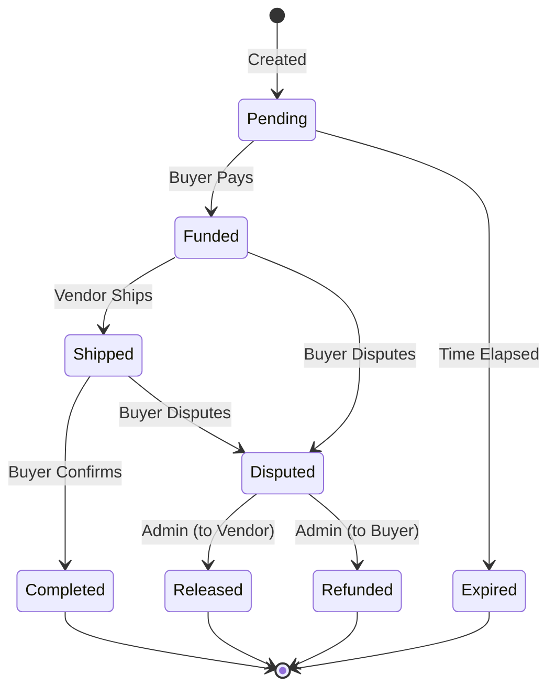

# 🌐 TrustLink — Frontend

> **The Web2 experience. The Web3 guarantee.**

[](https://nextjs.org)
[](https://tailwindcss.com)
[](https://typescriptlang.org)
[](https://stellar.org)
[](https://www.drips.network/wave/stellar)
[](CONTRIBUTING.md)

---

## Overview

The TrustLink frontend is a **Next.js 14 web application** that makes decentralized escrow feel as simple as sending a payment link. Vendors generate a Smart Escrow Link in seconds. Buyers click a link, pay with a Stellar wallet, and their funds are held by a Soroban contract until the order is delivered.

No wallets to explain. No blockchain jargon. No friction.

### Key User Journeys

```
VENDOR FLOW                          BUYER FLOW
───────────────────────────────      ─────────────────────────────────
1. Connect Freighter wallet          1. Click Smart Escrow Link
2. Fill order form                   2. See order summary & price
   (item, price, shipping window)    3. Connect wallet or use hosted
3. Get a shareable link              4. Approve USDC payment
4. Share on WhatsApp / Instagram     5. Track shipment status
5. Track escrow status               6. Confirm delivery OR
6. Receive payout on delivery           raise a dispute
```

---

## Features

- **🔗 Smart Link Generator** — Vendors create escrow links with one form. Links are shareable anywhere — DMs, bios, stories.
- **💳 Wallet-native Payments** — Integrates Freighter SDK for in-browser Stellar transaction signing. No private key exposure.
- **📦 Shipment Tracker** — Live shipment status pulled from logistics APIs (Terminal Africa / GIGL) displayed inline.
- **⚖️ Dispute Dashboard** — Buyers can flag issues, upload evidence, and track resolution status.
- **🔔 Real-time Notifications** — Email and SMS alerts via SendGrid/Twilio at every state change.
- **📱 Mobile-first Design** — Built for the social commerce audience — primarily on mobile.
- **🌍 No Crypto Knowledge Required** — Blockchain complexity is entirely abstracted from the buyer experience.

---

## Architecture

```
trustlink-frontend/
│
├── app/                            # Next.js App Router
│   ├── (vendor)/                   # Vendor-authenticated routes
│   │   ├── dashboard/              # Vendor escrow dashboard
│   │   ├── create/                 # Smart Escrow Link generator
│   │   └── disputes/               # Outgoing dispute view
│   │
│   ├── pay/[escrowId]/             # Buyer payment page (public)
│   ├── track/[escrowId]/           # Order tracking page (public)
│   ├── dispute/[escrowId]/         # Buyer dispute submission
│   │
│   ├── admin/                      # Admin dispute resolution panel
│   └── api/                        # Next.js API routes
│       ├── escrow/                 # Escrow creation & status
│       ├── webhooks/               # Logistics API webhooks
│       └── notifications/          # Email/SMS triggers
│
├── components/
│   ├── ui/                         # shadcn/ui base components
│   ├── escrow/                     # Escrow-domain components
│   │   ├── EscrowLinkCard.tsx
│   │   ├── PaymentForm.tsx
│   │   ├── TrackingTimeline.tsx
│   │   └── DisputeForm.tsx
│   ├── wallet/                     # Freighter wallet components
│   │   ├── WalletConnectButton.tsx
│   │   └── WalletProvider.tsx
│   └── layout/                     # Shared layout components
│
├── lib/
│   ├── stellar/                    # Stellar / Soroban SDK wrappers
│   │   ├── contract.ts             # Contract interaction helpers
│   │   ├── freighter.ts            # Freighter wallet integration
│   │   └── horizon.ts              # Horizon API utilities
│   ├── api/                        # Backend API client
│   └── utils/                      # Shared utilities
│
├── hooks/                          # Custom React hooks
│   ├── useEscrow.ts
│   ├── useWallet.ts
│   └── useTracking.ts
│
└── types/                          # Shared TypeScript types
```

### Escrow State Machine



---

## Getting Started

### Prerequisites

- Node.js `18.17+`
- npm / yarn / pnpm
- [Freighter Wallet](https://freighter.app/) browser extension (for testing wallet flows)
- A running instance of the [TrustLink Backend](https://github.com/your-org/trustlink-backend)

### Environment Variables

Create a `.env.local` file at the project root:

```env
# Backend API
NEXT_PUBLIC_API_URL=http://localhost:3001

# Stellar Network
NEXT_PUBLIC_STELLAR_NETWORK=testnet
NEXT_PUBLIC_CONTRACT_ID=C...              # Your deployed Soroban contract ID
NEXT_PUBLIC_USDC_CONTRACT=C...            # USDC token contract address (testnet)

# Horizon RPC
NEXT_PUBLIC_HORIZON_URL=https://horizon-testnet.stellar.org
NEXT_PUBLIC_SOROBAN_RPC_URL=https://soroban-testnet.stellar.org

# Optional: Analytics
NEXT_PUBLIC_POSTHOG_KEY=phc_...
```

### Installation & Development

```bash
# Clone the repository
git clone https://github.com/your-org/trustlink-frontend
cd trustlink-frontend

# Install dependencies
npm install

# Start the development server
npm run dev
```

Open [http://localhost:3000](http://localhost:3000) in your browser.

### Build for Production

```bash
npm run build
npm start
```

---

## Troubleshooting

### Node Version Mismatch

**Problem**: Build fails with errors like `error:0308010C:digital envelope routines::unsupported` or `SyntaxError: Unexpected token`.

**Solution**:

1. Check the required Node.js version in `.nvmrc` (requires Node.js 18.17+)
2. Install and use the correct version:

   ```bash
   # If using nvm
   nvm install
   nvm use

   # Verify version
   node --version  # Should be 18.17 or higher
   ```

3. Delete `node_modules` and reinstall:
   ```bash
   rm -rf node_modules package-lock.json
   npm install
   ```

### Missing Environment Variables

**Problem**: App crashes on startup with "Missing environment configuration" error.

**Solution**:

1. Create a `.env.local` file by copying the example:
   ```bash
   cp .env.example .env.local
   ```
 2. Fill in the required variables (see `docs/ENV_VARS.md` for details):
   ```env
   NEXT_PUBLIC_API_URL=http://localhost:3001
   NEXT_PUBLIC_STELLAR_NETWORK=testnet
   NEXT_PUBLIC_CONTRACT_ID=your-contract-id
   ```
3. Restart the development server:
   ```bash
   npm run dev
   ```

### Backend API Unavailable (CORS Errors)

**Problem**: Browser console shows CORS errors like `Access to fetch at 'http://localhost:3001' has been blocked`.

**Solution**:

**Option 1: Start the backend server**

1. Clone and run the [TrustLink Backend](https://github.com/your-org/trustlink-backend)
2. Ensure it's running on the port specified in `NEXT_PUBLIC_API_URL`

**Option 2: Use a deployed backend**

```env
# In .env.local
NEXT_PUBLIC_API_URL=https://api-staging.trustlink.app
```

**Option 3: Mock API responses for frontend-only development**

1. Use Next.js API routes as a proxy (see `app/api/` directory)
2. Or use MSW (Mock Service Worker) for development:
   ```bash
   npm install -D msw
   npx msw init public/
   ```

### Freighter Wallet Connection Issues

**Problem**: "Wallet not detected" or "Failed to connect wallet" errors.

**Solution**:

**For localhost connections:**

1. Install [Freighter Wallet Extension](https://freighter.app/)
2. Enable "Experimental Mode" in Freighter settings to allow localhost connections
3. Ensure you're on the correct network (testnet/mainnet) matching `NEXT_PUBLIC_STELLAR_NETWORK`
4. Try disconnecting and reconnecting the wallet
5. Clear browser cache and reload if the issue persists

**For network mismatch:**

```bash
# Check your .env.local
NEXT_PUBLIC_STELLAR_NETWORK=testnet  # Must match Freighter's selected network
```

**Freighter not installed:**

- The app should show a "Install Freighter" prompt
- If not, check browser console for errors
- Verify `useWallet` hook is properly initialized in `WalletProvider`

### Port Already in Use

**Problem**: Development server fails to start with `EADDRINUSE: address already in use :::3000`.

**Solution**:

```bash
# Find and kill the process using port 3000
lsof -ti:3000 | xargs kill -9

# Or use a different port
PORT=3001 npm run dev
```

### Build Errors After Git Pull

**Problem**: Build fails after pulling latest changes.

**Solution**:

1. Reinstall dependencies (lockfile may have changed):
   ```bash
   npm install
   ```
2. Clear Next.js cache:
   ```bash
   rm -rf .next
   npm run dev
   ```
3. Check for new required environment variables in `.env.example`

### Slow Performance in Development

**Problem**: Hot reload takes too long, or pages load slowly.

**Solution**:

1. Ensure you're using Node.js 18.17+ (older versions are slower)
2. Reduce polling intervals in development:
   ```typescript
   // Temporarily disable or increase polling intervals
   pollingInterval: process.env.NODE_ENV === "development" ? 60_000 : 30_000;
   ```
3. Disable source maps in `next.config.ts` for faster builds (development only):
   ```typescript
   productionBrowserSourceMaps: false;
   ```

For more detailed configuration information, see:

- `docs/ENV_VARS.md` - Complete environment variable documentation (also available as `ENV_VARS.md` at root)
- `DEPLOYMENT.md` - Production deployment checklist
- `CONTRIBUTING.md` - Development workflow and guidelines

---

## Key Integrations

### Freighter Wallet (Stellar)

Wallet interactions are wrapped in a reusable hook:

```typescript
import { useWallet } from "@/hooks/useWallet";

const { isConnected, publicKey, signTransaction } = useWallet();

// Connect wallet
await connect();

// Sign and submit a Soroban contract call
const result = await signTransaction(xdr, { network: "TESTNET" });
```

### Soroban Contract Calls

Smart Escrow Link generation triggers a contract interaction:

```typescript
import { fundEscrow } from "@/lib/stellar/contract";

// Buyer funds the escrow — this prompts Freighter for signature
const { hash } = await fundEscrow({
  escrowId,
  buyerAddress: publicKey,
  amount: BigInt(escrow.amount),
});
```

### Logistics API (Terminal Africa)

Real-time shipment status is polled from the backend and rendered as a visual timeline:

```typescript
import { useEscrow } from "@/hooks/useEscrow";

const {
  data: escrow,
  isLoading,
  error,
  refetch,
} = useEscrow(escrowId, {
  pollingInterval: 30_000,
});

// Tracking pages can revalidate escrow status while they are open.
```

---

## Testing

```bash
# Unit tests (Jest + React Testing Library)
npm run test

# End-to-end tests (Playwright)
npm run test:e2e

# End-to-end tests in Playwright UI mode (interactive debugging)
npm run test:e2e:ui

# Type checking
npm run type-check

# Lint
npm run lint
```

### Test Coverage Goals

- [ ] Wallet connect / disconnect flows
- [ ] Escrow link generation form validation
- [ ] Payment page — funded vs unfunded state
- [ ] Tracking timeline rendering
- [ ] Dispute form submission
- [ ] Mobile responsiveness (Playwright viewport tests)

---

## Design System

TrustLink uses **shadcn/ui** components built on Radix UI primitives, styled with TailwindCSS. The design language is intentionally clean and "trust-signalling" — we're asking people to commit real money through a social media link.

### Color Tokens

| Token           | Value                      | Usage                              |
| --------------- | -------------------------- | ---------------------------------- |
| `--primary`     | `#1B2A6B` (navy)           | CTAs, headers                      |
| `--accent`      | `#7B68EE` (stellar purple) | Highlights, links                  |
| `--success`     | `#22C55E`                  | Delivery confirmed, funds released |
| `--warning`     | `#D97706`                  | In transit, awaiting confirmation  |
| `--destructive` | `#EF4444`                  | Dispute raised, errors             |

### Component Rules

- All payment-facing pages must show the escrow contract address in a visible `trust badge`.
- State changes (Funded, Shipped, Completed) must trigger visible feedback — no silent updates.
- Skeleton loaders for all async data — no layout shift.

---

## Contributing via Stellar Wave

This repo is part of the **[Stellar Wave Program](https://www.drips.network/wave/stellar)** — join the sprint, pick an issue, earn rewards.

### Good First Issues

Look for [`good first issue`](../../issues?q=label%3A%22good+first+issue%22) and [`Stellar Wave`](../../issues?q=label%3A%22Stellar+Wave%22) labels.

**Example beginner-friendly tasks:**

- Add loading skeleton to the `TrackingTimeline` component
- Improve mobile layout of the payment confirmation page
- Add form field validation messages to `EscrowLinkGenerator`
- Write a unit test for `useWallet` hook
- Improve accessibility (ARIA labels) on the dispute form

**Example medium tasks:**

- Implement dark mode support
- Add a "Copy Link" with QR code generator on the link creation success page
- Build the vendor analytics dashboard page
- Add i18n support for Nigerian Pidgin / French (West Africa focus)

### Contribution Workflow

```bash
# 1. Fork the repo and create your branch
git checkout -b feat/your-feature-name

# 2. Make your changes and write tests

# 3. Ensure everything passes
npm run test && npm run lint && npm run type-check

# 4. Commit using conventional commits
git commit -m "feat: add QR code to escrow link success page"

# 5. Open a Pull Request — describe what you did and reference the issue
```

---

## 🗺️ Roadmap

- [x] Vendor dashboard (escrow creation, link sharing)
- [x] Buyer payment page (wallet connect + fund)
- [x] Order tracking timeline
- [x] Dispute form
- [ ] Admin dispute resolution panel
- [ ] Vendor analytics dashboard (transaction volume, payout history)
- [ ] Mobile app wrapper (React Native / PWA)
- [ ] WhatsApp Pay integration (for non-wallet buyers)
- [ ] Multi-language support (FR, HA, YO)
- [ ] Vendor pro tier (custom branding)

---

## 📜 License

MIT © TrustLink Contributors

---

> Powered by Next.js · Secured by Stellar Soroban · Part of the Stellar Wave ecosystem.

## Recent Changes
- Ongoing improvements and fixes as part of active development.
- See commit history and open issues for detailed change tracking.
